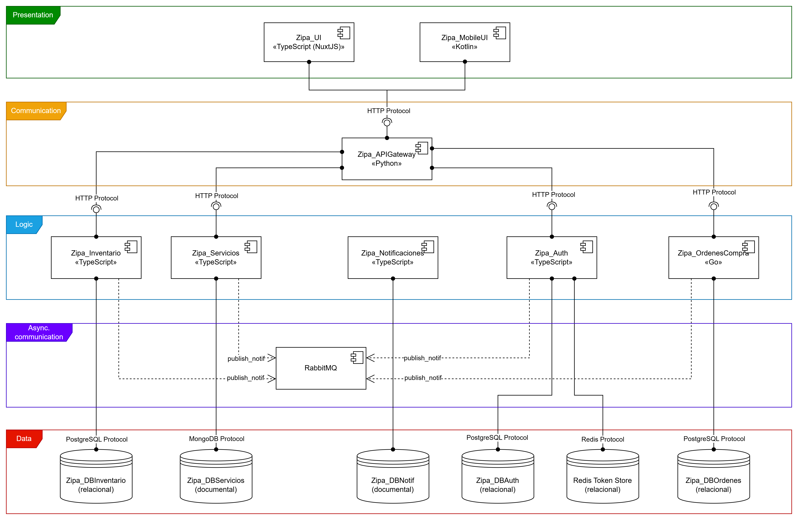
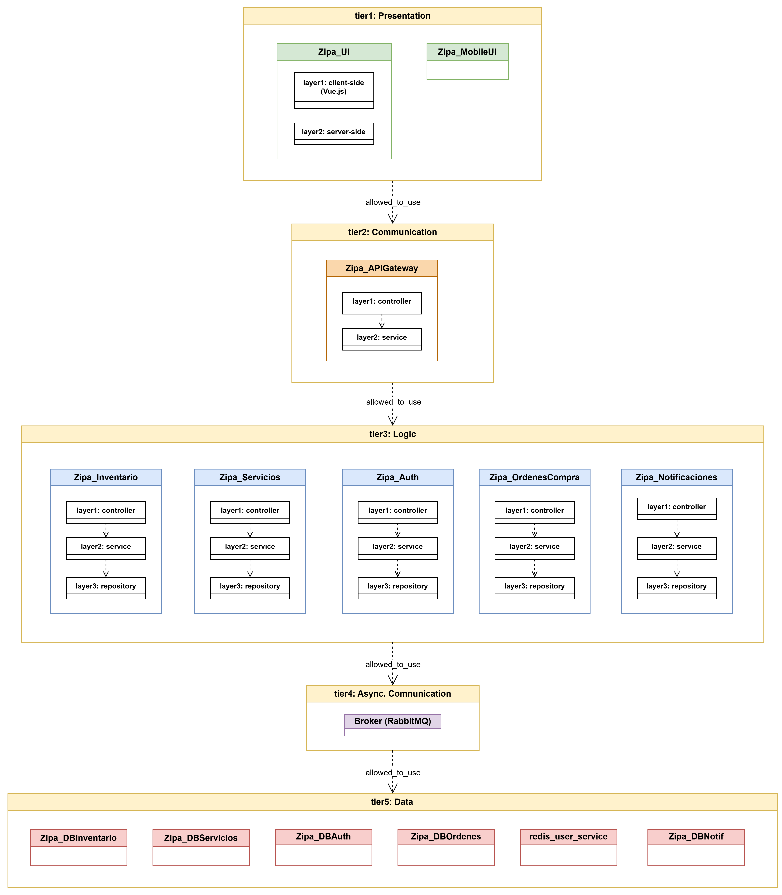
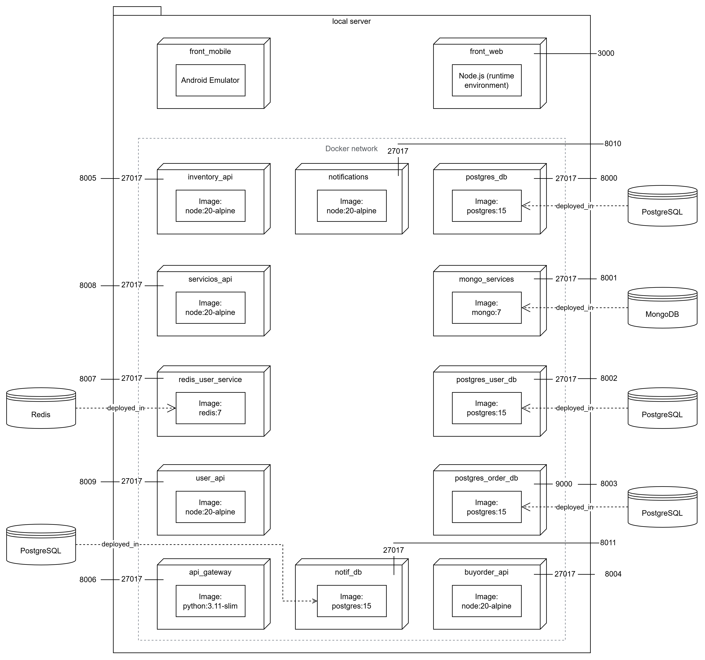
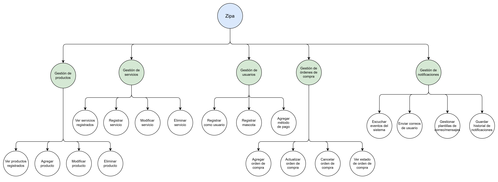

<div style="display: flex; justify-content: center; align-items: center;">
  
</div>

# Zipa: Tienda de productos y servicios para mascotas (PetShop)
## Equipo 2D
- Diego Humberto Lavado González
- Fabián Alejandro Torres Ramos
- Juan Camilo Daza Gutiérrez
- Santiago Alfonso Pineda Ceballos
- Victor Manuel Torres Alonso

## Descripción general
El sistema se propone como una plataforma para la gestión de una tienda de mascotas en línea. Permite a los usuarios visualizar y crear órdenes de compra/agendamiento para una variedad de productos y servicios de veterinaria que los dueños de la tienda deseen ofrecer.

Se contempla para este prototipo la administración de perfiles de usuario, la gestión de inventario de la tienda, la gestión de servicios como peluquería, baño, corte de uñas, etc., la creación de órdenes de compra por parte de usuarios y el control de notificaciones al usuario en caso de cambios en inventario o disponibilidad. Cuenta con interfaz de usuario tanto web como móvil.

## Descripción de arquitectura
El siguiente es el rediseño de la arquitectura del proyecto ZIPA expresado en las 4 vistas requeridas de:
1. Componentes y Conectores
2. Despliegue
3. Capas
4. Descomposición

En cuanto a lenguajes de programación de propósito general se incorporaron los siguientes:
- TypeScript para la mayoría de componentes y el front-end web
- Go para el componente Zipa_OrdenesCompra
- Python para el componente orquestador (API Gateway)
- Kotlin para el front-end móvil

El front-end web implementa SSR (Server-Side Rendering) mediante el framework de Nuxt, el cual automáticamente utiliza Vue.js como una capa adicional de renderizado al cliente y la cual se _hidrata_ al recibir interacciones.

# Arquitectura

## Vista de componentes y conectores
<div style="display: flex; justify-content: center; align-items: center;">
  
</div>

### Estilo Arquitectónico
Se hace uso de una arquitectura basada en SOFEA, que divide el sistema en servicios, con su respectiva separación entre frontend y backend. En concreto este prototipo implementa los dos servicios esenciales, **inventario** y **servicios**, incluyendo frontend, backend y bases de datos. Dichos componentes están resaltados en **verde** en el diagrama.


### Identificación de elementos arquitectónicos
- 5 Componentes y 4 conectores


### Relaciones entre Componentes

- **Gestión de servicios ↔ Historial de servicios:**  
  El componente de Gestión de Servicios se conecta a la BD MongoDB usando el protocolo TCP para operaciones de persistencia sobre los datos NoSQL.

- **Gestión de Inventario ↔ Productos:**  
  El componente de Gestión de Inventarios se conecta al servidor de PosgresQL usando el protocolo TCP para operaciones de persistencia con los datos SQL.

- **User Interface ↔ Gestión de servicios:**  
  El cliente web consume la API GraphQL expuesta por el componente de Gestión de servicios a través de HTTP en el puerto 8000.

- **User Interface ↔ Gestión de Inventario:**  
  El cliente web consume la API REST expuesta por el componente de Gestión de Inventario a través de HTTP en el puerto 8001.

## Vista de capas
<div style="display: flex; justify-content: center; align-items: center;">
  
</div>

Siguiendo la forma en la que los componentes están estructurados se divide el sistema en 5 capas físicas (_tiers_):
1. Capa de presentación: Contiene a los dos componentes de frontend, con los que interactúa el usuario.
2. Capa de comunicación: Contiene al componente orquestador, que actúa como punto de entrada a todas las peticiones que se realicen desde el frontend.
3. Capa de lógica: Contiene a los componentes de lógica de negocio.
4. Capa de comunicación asíncrona: Contiene al componente de mensajería que utilizan los componentes lógicos para comunicarse con el componente de notificaciones.
5. Capa de datos: Contiene a las bases de datos y asegura su persistencia.

Varios de los componentes también cuentan con capas lógicas (_layers_) para organizar su funcionamiento:
- El componente Zipa_UI cuenta con SSR, el cual se representa con dos capas lógicas para los elementos de frontend renderizados de lado del cliente como de lado del servidor.
- Los componentes lógicos y el API Gateway cuentan con controlador (para exponer su interfaz), servicio (que contiene la lógica) y repositorio (para conectar con una base de datos cuando aplica).

## Vista de despliegue

<div style="display: flex; justify-content: center; align-items: center;">
  
</div>

###  Estructura General del Entorno

El sistema está desplegado en un **servidor local**, donde cada componente opera como un contenedor independiente:

- **Red interna Docker:** permite la comunicación entre servicios usando el puerto común `27017`.
- **Bases de datos externas:** PostgreSQL, MongoDB y Redis se ejecutan en contenedores separados, enlazados con sus respectivos servicios API.

---

####   Frontend

| Componente | Descripción | Puerto |
|-------------|-------------|--------|
| **front_web** | Interfaz web construida con Node.js que sirve la aplicación del cliente. | 3000 |
| **front_mobile** | Aplicación móvil desplegada en un emulador Android, conectada al mismo entorno local. | — |

---

####    Backend (Microservicios)

| Servicio | Imagen base | Puerto | Descripción |
|-----------|--------------|--------|--------------|
| **inventory_api** | `node:20-alpine` | 8005 | Gestiona productos, stock y categorías del inventario. |
| **servicios_api** | `node:20-alpine` | 8008 | Maneja los servicios para mascotas (baño, guardería, veterinaria). |
| **user_api** | `node:20-alpine` | 8009 | Gestiona usuarios, autenticación y roles. |
| **buyorder_api** | `node:20-alpine` | 8004 | Controla pedidos y órdenes de compra. |
| **notifications** | `node:20-alpine` | 8010 | Administra las notificaciones asincrónicas hacia los usuarios y administradores. |
| **api_gateway** | `python:3.11-slim` | 8006 | Orquesta las peticiones entre los microservicios y expone los endpoints unificados hacia el cliente. |

---

####    Bases de Datos Asociadas

| Servicio | Imagen | Puerto | Asociado a |
|-----------|---------|--------|-------------|
| **postgres_db** | `postgres:15` | 8000 | Servicios generales del sistema. |
| **mongo_services** | `mongo:7` | 8001 | Módulo de servicios de mascotas. |
| **postgres_user_db** | `postgres:15` | 8002 | Módulo de usuarios. |
| **postgres_order_db** | `postgres:15` | 8003 | Módulo de órdenes y compras. |
| **notlf_db** | `postgres:15` | 8011 | Módulo de notificaciones. |
| **redis_user_service** | `redis:7` | 8007 | Cacheo y sesiones del servicio de usuarios. |

---

####    Conectividad y Red

- Todos los contenedores se comunican dentro de una **red Docker interna** (`27017`).
- Cada microservicio se conecta únicamente con su base de datos correspondiente.
- El **API Gateway** actúa como punto de entrada para el frontend, delegando las solicitudes a los microservicios.
- **Redis** se utiliza como sistema de almacenamiento en memoria para mejorar el rendimiento y manejo de sesiones.

---

####    Tecnologías Principales

- **Node.js (v20)** → Backend de los microservicios principales.  
- **Python 3.11 (Slim)** → API Gateway.  
- **PostgreSQL 15** → Bases de datos relacionales.  
- **MongoDB 7** → Almacenamiento de datos no estructurados.  
- **Redis 7** → Cache y manejo de sesiones.  
- **Docker Compose** → Orquestación y despliegue de contenedores.

---


## Vista de descomposición

<div style="display: flex; justify-content: center; align-items: center;">
  
</div>

### Elementos y Relaciones Arquitectónicas

#### **Módulo de Gestión de Productos**
**Propósito:** Administra todas las operaciones relacionadas con los productos disponibles en la plataforma, permitiendo su control, visualización y mantenimiento.  
**Funciones principales:** Incluye la visualización de los productos registrados, la adición de nuevos productos, la modificación de información existente y la eliminación de productos obsoletos o inactivos.  
**Relaciones:** Se comunica con el Módulo de Órdenes de Compra para validar la disponibilidad de productos en los procesos de compra y con el Módulo de Notificaciones para informar sobre cambios en el inventario o actualizaciones relevantes.

---

#### **Módulo de Gestión de Servicios**
**Propósito:** Gestiona los servicios ofrecidos dentro del ecosistema de Zipa, como atención veterinaria, aseo, hospedaje o paseos.  
**Funciones principales:** Permite registrar, modificar y eliminar servicios, así como consultar los servicios activos en la plataforma.  
**Relaciones:** Interactúa con el Módulo de Usuarios para vincular los servicios con sus prestadores y clientes, y con el Módulo de Notificaciones para comunicar confirmaciones o recordatorios sobre la reserva o modificación de servicios.

---

#### **Módulo de Gestión de Usuarios**
**Propósito:** Administra el registro, autenticación y mantenimiento de la información de los usuarios, incluyendo clientes, administradores y proveedores.  
**Funciones principales:** Permite registrar usuarios, registrar mascotas asociadas y agregar métodos de pago para facilitar las transacciones dentro del sistema.  
**Relaciones:** Se comunica con el Módulo de Órdenes de Compra para asociar la identidad del comprador con sus transacciones, y con el Módulo de Notificaciones para enviar alertas, correos de confirmación o mensajes relacionados con la cuenta del usuario.

---

#### **Módulo de Gestión de Órdenes de Compra**
**Propósito:** Controla el flujo completo de las órdenes de compra, desde su creación hasta su actualización o cancelación, garantizando la integridad de los datos y la trazabilidad de las transacciones.  
**Funciones principales:** Permite agregar nuevas órdenes, actualizar información existente, cancelar operaciones y consultar el estado actual de cada orden.  
**Relaciones:** Depende de los módulos de Productos, Servicios y Usuarios para obtener información necesaria durante la creación o actualización de órdenes. Se comunica con el Módulo de Notificaciones para enviar confirmaciones, actualizaciones y avisos sobre el estado de las órdenes.

---

#### **Módulo de Gestión de Notificaciones**
**Propósito:** Centraliza la gestión de todos los eventos comunicativos del sistema, garantizando que los usuarios y los servicios reciban notificaciones en tiempo real o de forma diferida según corresponda.  
**Funciones principales:** Escucha los eventos generados por otros módulos del sistema, envía correos electrónicos a los usuarios, gestiona plantillas de mensajes y mantiene un historial de notificaciones.  
**Relaciones:** Recibe información de todos los módulos funcionales mediante comunicación asíncrona o eventos internos, con el fin de enviar alertas, confirmaciones y recordatorios. Opera de forma desacoplada para no interferir con los procesos principales del sistema.

---

#### **Relaciones Generales entre Módulos**
- **Usuarios ↔ Órdenes:** asociación de identidad, medios de pago y control de transacciones.  
- **Productos / Servicios ↔ Órdenes:** vinculación de elementos seleccionados con el flujo de compra o reserva.  
- **Órdenes ↔ Notificaciones:** envío de confirmaciones y actualizaciones del estado de las órdenes.  
- **Global ↔ Notificaciones:** todos los módulos pueden emitir eventos que desencadenan notificaciones, lo cual refuerza la comunicación asincrónica y la independencia funcional.


# Instrucciones para despliegue del software de manera local

## Requisitos previos
1. **Git** instalado y accesible desde la terminal.
2. **Docker** y **Docker Compose** instalados y configurados correctamente.
3. **WSL** instalado si el sistema se ejecutará en Windows.

## Instrucciones paso a paso

### 1. Clonar el repositorio con submódulos

```bash
git clone --recurse-submodules https://github.com/ZipaApp/ZipaRaiz.git
```
###  2. Construir y montar el contenedor en docker
```bash
docker compose up --build
```