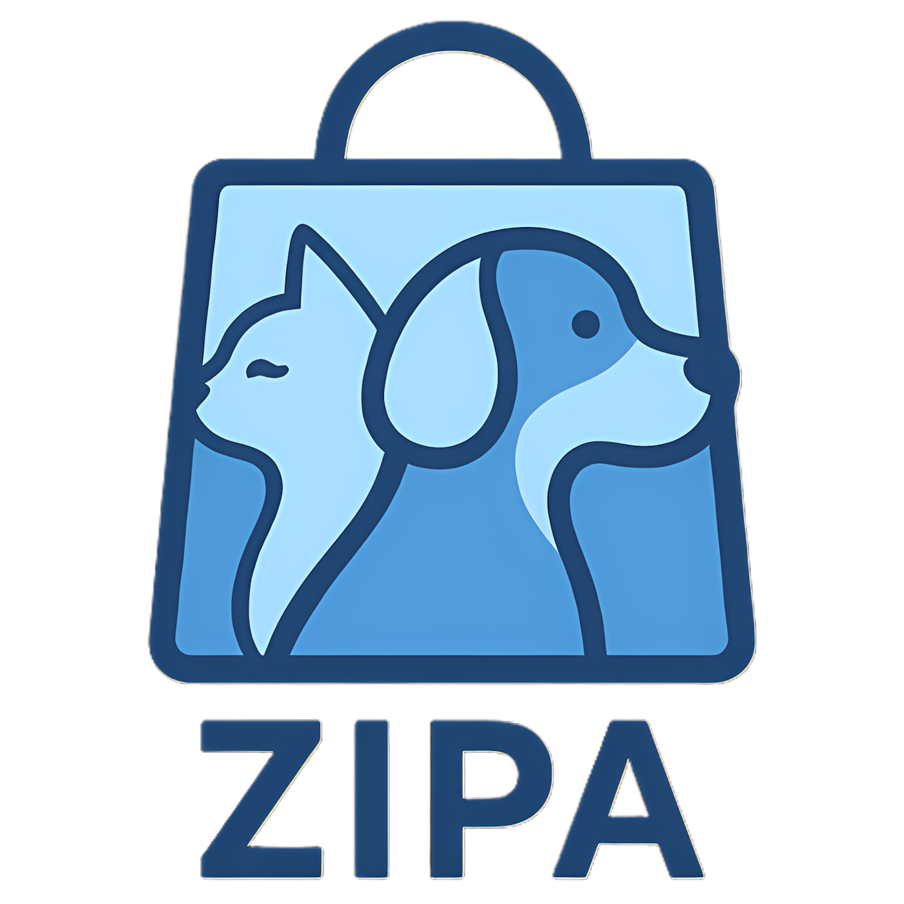
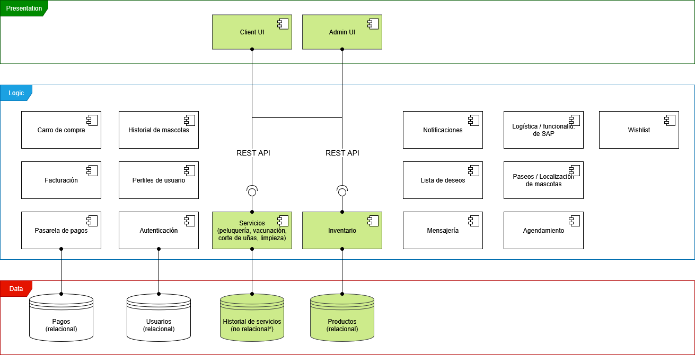

  
  <h1 style="margin: 0;">Tienda de productos y servicos para mascotas</h2>

## Equipo 2D
- Victor Manuel Torres Alonso
- Diego Humberto Lavado González
- Juan Camilo Alvarado Caro
- Javier Estéban González Vivas
- Fabián Alejandro Torres Ramos
- Juan Camilo Daza Gutiérrez
- Santiago Alfonso Pineda Ceballos

## Descripción General
El sistema corresponde a una plataforma integral para la gestión de una tienda de mascotas en línea. Permite a los clientes explorar y adquirir productos a través de un carrito de compras, realizar pagos mediante una pasarela segura y acceder a servicios especializados como peluquería, vacunación, corte de uñas y limpieza, los cuales pueden ser agendados de manera digital.

La plataforma contempla la administración de perfiles de usuario y el almacenamiento del historial de cada mascota, incluyendo tanto servicios recibidos como productos adquiridos. Adicionalmente, ofrece funcionalidades de lista de deseos, notificaciones automáticas y mensajería, lo que facilita la interacción con la tienda y el seguimiento de actividades.

El sistema integra también opciones relacionadas con la logística, como la localización de mascotas y la coordinación de servicios externos, garantizando un control más amplio de la operación.

Desde el ámbito administrativo, se dispone de herramientas de gestión de inventario, control de usuarios y manejo de facturación y pagos, lo que proporciona una visión completa para el personal encargado de la operación del negocio.

En conjunto, la solución no solo funciona como una tienda virtual de productos para mascotas, sino que incorpora la gestión de servicios, el seguimiento de historial de usuarios y mascotas, y mecanismos de comunicación y coordinación.

## Arquitectura

### Vista de componentes y conectores

  

### Estilo Arquitectónico
Se hace uso de una arquitectura basada en SOFEA, que divide el sistema en servicios, con su respectiva separación entre frontend y backend. En concreto este prototipo implementa los dos servicios esenciales, **inventario** y **servicios**, incluyendo frontend, backend y bases de datos. Dichos componentes están resaltados en verde en el diagrama.

### Componentes y Conectores
- **Frontend Web**: Un único componente front, tal como se decribe en SOFEA, haciendo uso de Nuxt.js, que abarcará toda la UI del sistema.
- **APIs**: Una API para cada servicio, usando NestJS, que se conectará con la respectivas bases de datos.
- **Base de datos - Inventario**: Una base de datos relacional en PostgreSQL, para el servicio de **inventario**.
- **Base de datos - Servicios**: Una base de datos no relacional en Mongo, para el servicio de **servicios**.
 

 

- **HTTP-REST**: Conector entre frontend y backend del servicio de **inventario**.
- **HTTP-GraphQL**: Conector entre frontend y backend del servicio de **servicios**.
- **Prisma**: Conector entre las APIs y las bases de datos.

