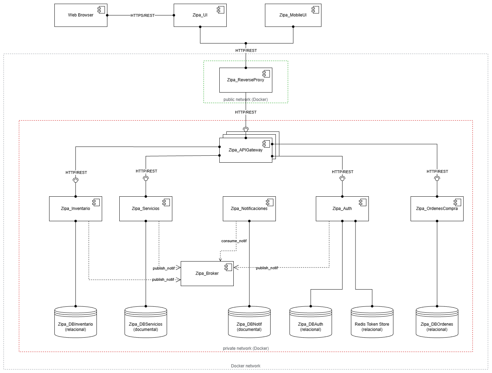
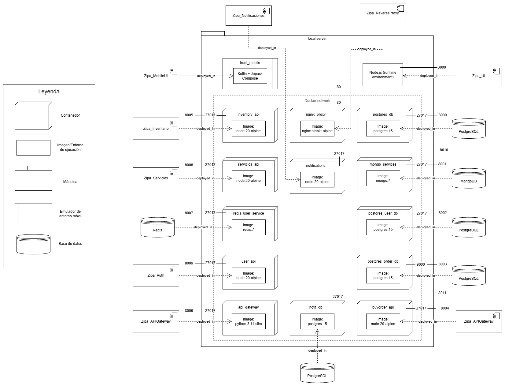
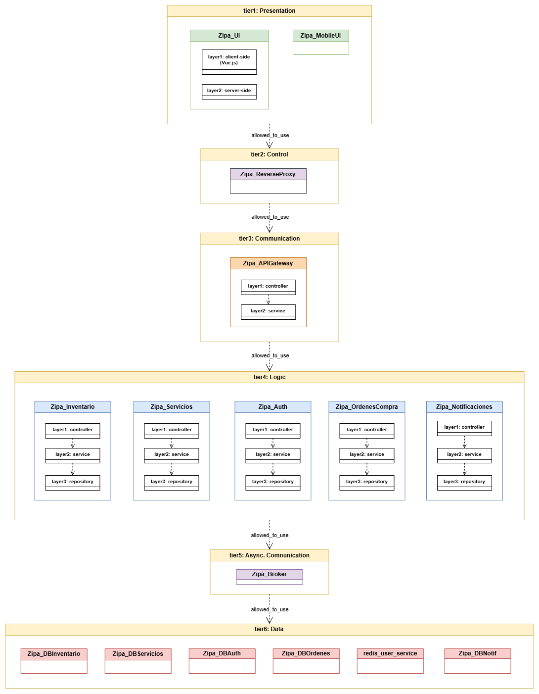
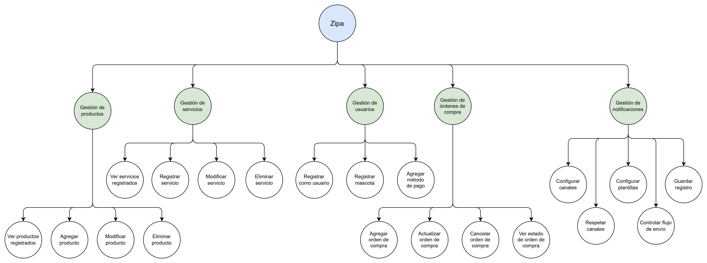
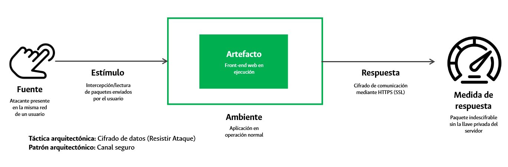
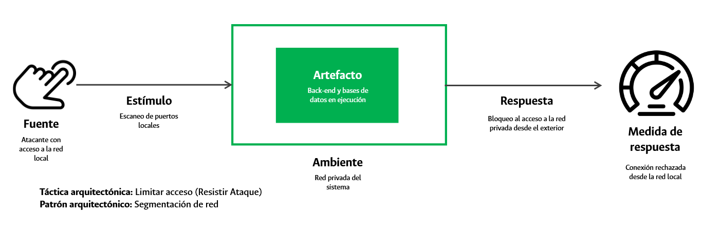
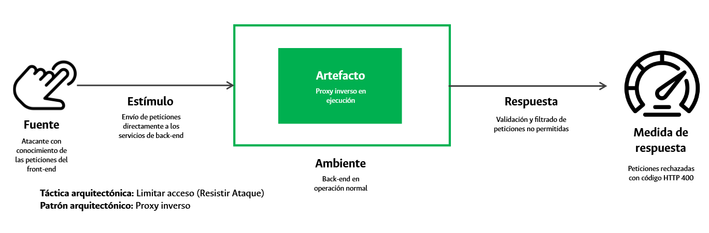
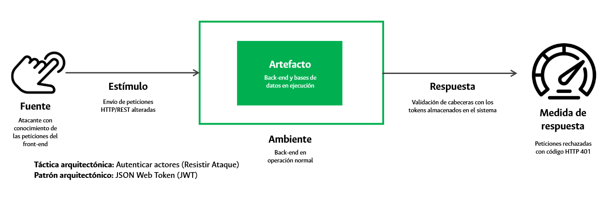
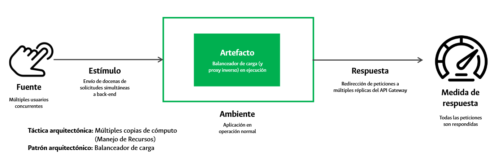

<div style="display: flex; justify-content: center; align-items: center;">
  
  <h1 style="margin: 0;">Prototipo 3 - Atributos de calidad, parte 1</h2>
</div>

# Zipa: Tienda de productos y servicios para mascotas (PetShop)

## Equipo 2D
- Diego Humberto Lavado González
- Victor Manuel Torres Alonso
- Fabián Alejandro Torres Ramos
- Juan Camilo Daza Gutiérrez
- Santiago Alfonso Pineda Ceballos

## Descripción general
El sistema se propone como una plataforma para la gestión de una tienda de mascotas en línea. Permite a los usuarios visualizar y crear órdenes de compra de productos y agendamiento de servicios, dentro de la variedad que hay en la tienda veterinaria, que sus propietarios deseen ofrecer.

Se contempla para este tercer prototipo la implementación de varios requerimientos no funcionales, principalmente en lo concerniente a calidad y seguridad.  En relación a las funcionalidades de seguridad del sistema ZIPA se han incorporado los patrones como canal seguro, proxy inverso, segmentación a nivel de red y firewall de aplicaciones web.

En relación a atributos de calidad se ha incorporado un balanceador de carga mediante software basado en el algoritmo de round-robin y se han realizado varias pruebas de carga y estrés al sistema ZIPA.


##  Elementos arquitectónicos
### Estructura de componentes y conectores.


<div style="display: flex; justify-content: center; align-items: center;">
  
</div>

### Descripción de los elementos arquitectónicos y sus relaciones.

A nivel de presentación se tiene clientes web y móvil (Zipa_UI, Zipa_MobileUI) que se conectan por HTTP al borde, exponiendo la interfaz de usuario y consumiendo APIs; actúan como consumidores de servicios REST.
En seguridad hay un proxy inverso (Zipa_ReverseProxy) que centraliza TLS/terminación y enrutamiento hacia el Zipa_APIGateway, aplicando políticas de seguridad y balanceo.
Como puerta de enlace se tiene a Zipa_APIGateway que orquesta llamadas sincronicas HTTP/REST hacia los servicios de dominio (Inventario, Servicios, Notificaciones, Auth, OrdenesCompra) y normaliza contratos y versiones.
En el componente asíncrono se tienen servicios independientes que implementan lógica de negocio y publican/consumen eventos vía Zipa_Broker para notificaciones y desacoplamiento eventual.
En persistencia cada servicio tiene su almacenamiento dedicado (relacional o documental) que incluye Redis para tokens, garantizando propiedad de datos, escalabilidad y autonomía de despliegue.

### Descripción de los estilos arquitectónicos y patrones usados.

Servicios SOA autónomos y acoplados débilmente con responsabilidad definida por dominio y almacenamiento propio.
Arquitectura en capas (presentación → gateway → lógica → datos) con proxy inverso y API Gateway para enrutamiento, seguridad y agregación.
Patrón broker para eventos asíncronos, notificaciones y desacoplamiento eventual; comunicación síncrona por REST cuando se necesita.

### Estructura de despliegue

<div style="display: flex; justify-content: center; align-items: center;">
  
</div>

### Descripción de los elementos arquitectónicos y sus relaciones.

Es una vista de arquitectura de servicios contenedorizada, que muestra la distribución física de los componentes sobre la infraestructura local. Los nodos de ejecución son contenedores Docker que representan unidades de despliegue servicios junto con bases de datos. Los artefactos desplegados se ejecutan sobre un servidor local host.
Las relaciones se modelan como conexiones de red internas (Docker network : 27017) y exposiciones de puertos al host (8000–9000). Se incluyen clientes externos (front_web, front_mobile) que interactúan con los servicios mediante endpoints HTTP.
Se trata de una vista de despliegue de 


### Descripción de los patrones arquitectónicos usados.

Vista de despliegue de una arquitectura basada en microservicios, donde cada componente funcional del sistema se implementa como un contenedor independiente dentro de un entorno Docker. Cada servicio se asocia a su propia base de datos, aplicando el patrón de persistencia por servicio. La comunicación entre los contenedores ocurre mediante una red interna de Docker, garantizando aislamiento y control del tráfico. El API Gateway centraliza la entrada de solicitudes, actuando como punto de acceso unificado para los microservicios y gestionando el enrutamiento hacia ellos. Los frontends web y móvil se ejecutan externamente y acceden al ecosistema a través de puertos expuestos en el servidor local. Este enfoque refleja el uso de contenerización e infraestructura inmutable para asegurar despliegues reproducibles y consistentes. La separación clara entre las capas de presentación, lógica y datos refuerza la modularidad del sistema. Asimismo, el uso de imágenes livianas optimiza los recursos del entorno local. En conjunto, la vista ilustra un despliegue típico de arquitectura de microservicios orquestada en un único host mediante Docker Compose.

### Estructura de capas


<div style="display: flex; justify-content: center; align-items: center;">
  
</div>

### Descripción de los elementos arquitectónicos y sus relaciones.

Esta vista por capas muestra la de presentación (Zipa_UI, Zipa_MobileUI) que invoca al Zipa_APIGateway en la capa de comunicación; el Gateway enruta y orquesta llamadas hacia los microservicios de la capa de lógica (Zipa_Inventario, Zipa_Servicios, Zipa_Auth, Zipa_OrdenesCompra, Zipa_Notificaciones), donde cada servicio tiene internamente controlador → servicio → repositorio y persiste en su almacén dedicado. La capa de comunicación asíncrona está representada por un Broker (RabbitMQ) usado por los servicios para publicar/consumir eventos, y la capa de datos agrupa las bases (Postgres/Mongo/Redis) que sirven como persistencia por servicio.

### Descripción de los patrones arquitectónicos usados.

Se aplican los patrones de arquitectura de capas y microservicios con separación de responsabilidades; un API Gateway central para entrada y enrutamiento; patrón interno controller–service–repository en cada servicio para organización y acceso a datos; pub/sub mediante Broker para comunicación asincrónica y desacoplamiento eventual; y persistencia políglota (database-per-service) para autonomía y escalado independiente.

### Estructura de descomposición


<div style="display: flex; justify-content: center; align-items: center;">
  
</div>

### Descripción de los elementos arquitectónicos y sus relaciones.

Esta vista de descomposición muestra a Zipa desglosado en subsistemas funcionales como son Gestión de productos (ver, agregar, modificar, eliminar), Gestión de servicios (listar, registrar, modificar, eliminar), Gestión de usuarios (registrar usuario, registrar mascota, registrar métodos de pago), Gestión de órdenes de compra (agregar, actualizar, cancelar, consultar estado) y Gestión de notificaciones (escuchar eventos, enviar correos, gestionar plantillas, guardar historial). Cada subsistema expone operaciones o casos de uso concretos y se conecta conceptualmente con el resto mediante llamadas a funciones/servicios y eventos del sistema, de modo que las acciones del dominio fluyen desde el nodo raíz hacia las hojas funcionales.
La vista aplica patrones de descomposición por dominio y vertical slicing (cada módulo encapsula sus casos de uso y CRUD asociados), enfatiza separación de responsabilidades y cohesion alta dentro de cada subsistema, y usa pub/sub para la gestión de notificaciones como mecanismo de desacoplamiento. Es coherente con enfoques DDD/ bounded-context y con microservicios/servicios autónomos en cuanto cada área puede implementarse y desplegarse de forma independiente.

## Atributos de calidad
### Seguridad

Escenario 1: Canal Seguro



Escenario 2: Segmentación de Red



Escenario 3: Proxy Inverso



Escenario 4: Uso de JWT



### Rendimiento y escalabilidad

Escenario 1: Balanceador de carga



## Requisitos previos de instalación
1. **Git** instalado y accesible desde la terminal.
2. **Docker** y **Docker Compose** instalados y configurados correctamente.
3. **WSL** instalado si el sistema se ejecutará en Windows.

## Instrucciones paso a paso

### 1. Clonar el repositorio con submódulos

HTTPS:
```bash
git clone --recurse-submodules https://github.com/ZipaApp/ZipaRaiz.git
```

SSH:
```bash
git clone --recurse-submodules git@github.com:ZipaApp/ZipaRaiz.git
```

###  2. Construir y montar el contenedor en docker

Construcción inicial:
```bash
docker compose up --build
```

Construcción con múltiples réplicas para el `api-gateway`:
```bash
docker compose up --build --scale api-gateway=3
```

### 3. Actualizar submódulos si es necesario

Para actualizar a los últimos commit de cada submódulo:
```bash
git submodule update --remote
```
