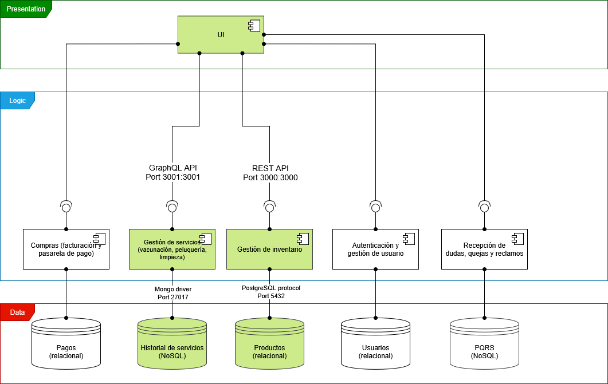

<div style="display: flex; justify-content: center; align-items: center;">
  
  <h1 style="margin: 0;">PetShop o tienda de productos y servicios para mascotas</h2>
</div>


## Equipo 2D
- Victor Manuel Torres Alonso
- Diego Humberto Lavado González
- Juan Camilo Alvarado Caro
- Javier Estéban González Vivas
- Fabián Alejandro Torres Ramos
- Juan Camilo Daza Gutiérrez
- Santiago Alfonso Pineda Ceballos

## Descripción General
El sistema corresponde a una plataforma integral para la gestión de una tienda de mascotas en línea. Permite a los clientes explorar y adquirir productos a través de un carrito de compras, realizar pagos mediante una pasarela segura y acceder a servicios especializados como peluquería, vacunación, corte de uñas y limpieza, los cuales pueden ser agendados de manera digital.

La plataforma contempla la administración de perfiles de usuario y el almacenamiento del historial de cada mascota, incluyendo tanto servicios recibidos como productos adquiridos. Adicionalmente, ofrece funcionalidades de lista de deseos, notificaciones automáticas y mensajería, lo que facilita la interacción con la tienda y el seguimiento de actividades.

El sistema integra también opciones relacionadas con la logística, como la localización de mascotas y la coordinación de servicios externos, garantizando un control más amplio de la operación.

Desde el ámbito administrativo, se dispone de herramientas de gestión de inventario, control de usuarios y manejo de facturación y pagos, lo que proporciona una visión completa para el personal encargado de la operación del negocio.

En conjunto, la solución no solo funciona como una tienda virtual de productos para mascotas, sino que incorpora la gestión de servicios, el seguimiento de historial de usuarios y mascotas, y mecanismos de comunicación y coordinación.


## Arquitectura

### Vista de componentes y conectores
<div style="display: flex; justify-content: center; align-items: center;">
  
</div>

### Estilo Arquitectónico
Se hace uso de una arquitectura basada en SOFEA, que divide el sistema en servicios, con su respectiva separación entre frontend y backend. En concreto este prototipo implementa los dos servicios esenciales, **inventario** y **servicios**, incluyendo frontend, backend y bases de datos. Dichos componentes están resaltados en **verde** en el diagrama.


### Identificación de elementos arquitectónicos
- 5 Componentes y 4 conectores

### Tabla de Componentes

| Componente                 | Responsabilidad                              | Límites                                   | Interfaz                          |
|----------------------------|----------------------------------------------|-------------------------------------------|------------------------------------|
| **Historial de servicios: Base de Datos MongoDB** | Almacenar y gestionar datos NoSQL para el sistema Zipa. | Expone operaciones de base de datos a través del puerto 27017, más no lógica de negocio. | Protocolo TCP en el puerto `27017`. |
| **Gestión de servicios: API Backend (GraphQL)** | Provee una API GraphQL para realizar los queris, mutaciones y suscripciones a través del backend con los datos almacenados en la BD NoSQL Historial de Servicios. | No gestiona interacciones directas de persistencia; delega persistencia a MongoDB. Expone únicamente la lógica de negocio hacia los servicios GraphQL. | HTTP (GraphQL) en el puerto `8000`. |
| **Productos: Base de Datos PosgresQL** | Almacena y gestiona datos estructurados (SQL) para el sistema. | Solo expone operaciones de base de datos a través del puerto 5432. No expone lógica de negocio. | Protocolo TCP en el puerto `5432` (PosgresQL). |
| **Gestión de Inventario: API Backend (REST)** | Proveer una API REST para el acceso y manipulación de datos almacenados en PosgresQL. | No gestiona almacenamiento directo; delega persistencia a PosgresQL. Expone únicamente la lógica de negocio y los servicios REST. | HTTP (REST) en el puerto `8001`. |
| **Navegador web**    | Consumir las APIs expuestas por los componentes de Gestión de Servicios  y Gestión de Inventario. | No hace persistencia ni ejecuta lógica de negocio del backend. | HTTP --> GraphQL y REST. |

### Tabla de Conectores

| Conector                              | Responsabilidad                              | Límites                                   | Interfaz                          |
|---------------------------------------|----------------------------------------------|-------------------------------------------|------------------------------------|
| **TCP - MongoDB Driver** | Facilita la comunicación entre el backend GraphQL y MongoDB para operaciones de persistencia con datos NoSQL. | Supeditado a las capacidades del protocolo o driver de MongoDB; no gestiona lógica de negocio. | Protocolo TCP sobre puerto `27017`. |
| **TCP - PosgresQL Driver** | Facilitar la comunicación entre el backend REST y PosgresQL para operaciones de persistencia con datos de tipo relacional. | Supeditado a las capacidades del protocolo PosgresQL; no gestiona lógica de negocio. | Protocolo TCP sobre puerto `5432`. |
| **GraphQL** | Permitir que desde el frontend unl cliente web envíe consultas y mutaciones al servidor GraphQL. | Supeditado a la interfaz HTTP/GraphQL; no gestiona persistencia ni lógica interna del backend. | HTTP sobre puerto `8000`. |
| **REST** | Permitir que el cliente web realice peticiones GET y POST al servidor REST. | Supeditado a la interfaz HTTP/REST; no gestiona persistencia ni lógica interna del backend. | HTTP sobre puerto `8001`. |


### Relaciones entre Componentes

- **Gestión de servicios ↔ Historial de servicios:**  
  El componente de Gestión de Servicios se conecta a la BD MongoDB usando el protocolo TCP para operaciones de persistencia sobre los datos NoSQL.

- **Gestión de Inventario ↔ Productos:**  
  El componente de Gestión de Inventarios se conecta al servidor de PosgresQL usando el protocolo TCP para operaciones de persistencia con los datos SQL.

- **User Interface ↔ Gestión de servicios:**  
  El cliente web consume la API GraphQL expuesta por el componente de Gestión de servicios a través de HTTP en el puerto 8000.

- **User Interface ↔ Gestión de Inventario:**  
  El cliente web consume la API REST expuesta por el componente de Gestión de Inventario a través de HTTP en el puerto 8001.


# Instrucciones para despliegue del software de manera local

## Requisitos previos
1. **Git** instalado y accesible desde la terminal.
2. **Docker** y **Docker Compose** instalados y configurados correctamente.
---

## Instrucciones paso a paso

### 1. Clonar el repositorio con submódulos

```bash
git clone --recurse-submodules https://github.com/ZipaApp/ZipaRaiz.git
```
###  2. Construir y montar el contenedor en docker
```bash
docker compose up --build
```
